# IBM i Development Basics Guide
## Get Ready for Bob with IBM i
#### version 1.1
This comprehensive guide is a cheat sheet that covers some aspects of IBM
i development, from traditional green-screen workflows to modern
development approaches using **VS Code with Code for IBM i extensions**
and now **IBM Bob**. 

The goal is to help the reader understand:

-   **Storage Architecture & IBM i interfaces**: QSYS vs IFS file systems
-   **Development Tools**: Traditional (PDM/SEU), RDi, and VS Code
-   **Compilation Models**: OPM vs ILE compilation and binding
-   **Source Code Management**: Native commands, third-party tools and
    Git integration
-   **Debugging**: Traditional STRDBG and modern graphical debugging
-   **Evolution**: How IBM i development has modernized over time

>  For more details, **the reader should refer to the synthetic [IBM i eBook- A Developer's Guide to Mastering IBM i Basics](https://programmers.io/ibmi-ebook/) or the official IBM Redbooks like [Modernizing IBM i Applications](https://www.redbooks.ibm.com/abstracts/sg248185.html)**.

>  In a project with **IBM Bob** and **IBM i**  the list of basic tools to install to 
>  administrate and develop on IBM i includes the vscode extensions **[IBM i Development   Pack](https://marketplace.visualstudio.com/items?itemName=HalcyonTechLtd.ibm-i-development-pack)** and **[Access Client Solution](https://www.ibm.com/support/pages/ibm-i-access-client-solutions)**

If you want to know more about what's running on IBM i, what languages are used in 2026 by the developers, please refer to the annual **[IBM i Marketplace Survey by Fortra](https://power.fortra.com/resources/guides/ibm-i-marketplace-survey-results)** 

------------------------------------------------------------------------

## Table of Contents

1.  [Traditional IBM i Development](#1-traditional-ibm-i-development)
2.  [RDi (Rational Developer for i)](#2-rdi-rational-developer-for-i)
3.  [Modern Development with VSCode](#3-modern-development-with-vs-code)
4.  [IBM i Compilation: OPM vs ILE](#4-ibm-i-compilation-opm-vs-ile)
5.  [Source Code Management (SCM) on IBMi](#5-source-code-management-scm-on-ibm-i)
6.  [ILE Debugging](#6-ile-debugging)
7.  [Comparison Summary](#7-comparison-summary)
8.  [IBM i Essential Concepts](#8-ibm-i-essential-concepts)
9.  [Key Takeaways](#9-key-takeaways)

------------------------------------------------------------------------

# 1. Traditional IBM i Development

Historically, IBM i developers worked entirely **on the system itself**,
using green-screen tools.

## Understanding IBM i Storage: QSYS vs IFS

IBM i has two distinct file systems for storing data and source code:

### QSYS (Library/Object World)

> Libraries are objects stored in the QSYS object namespace.
> Conceptually, QSYS behaves more like the root of the IBM i object
> space rather than a hierarchical parent directory.

**QSYS** is the native IBM i library system - think of it as the
traditional object-based world where: 
- **Libraries** act like folders/containers (e.g., MYLIB, QSYS) 
- **Physical Files** are similar to database tables that can store data or source code 
- **Members** are like partitions or versions within a physical file 
- each member contains the actual lines of source code 
- **Objects** include programs (*PGM), modules (*MODULE), service programs (\*SRVPGM), and more

When you edit source code in QSYS, you're actually editing a **member**
within a **source physical file** stored in a **library**.

### IFS (Integrated File System)

**IFS** is the modern Unix-like file system where: - Files and
directories work like Linux/Windows filesystems - Source code is stored
as regular files (e.g., `/home/dev/project/customer.rpgle`) - Compatible
with Git and modern development tools - Supports stream files, symbolic
links, and standard file operations

## IBM i Storage Architecture

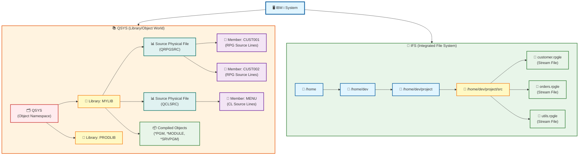

### Key Differences

| Aspect | QSYS (Library/Object) | IFS (Integrated File System) |
|--------|----------------------|------------------------------|
| Structure | Library → File → Member | Directory → File |
| Source Storage | Members in physical files | Stream files |
| Path Format | `MYLIB/QRPGSRC(CUST001)` | `/home/dev/project/customer.rpgle` |
| Git Compatible | ❌ Not natively (tooling required) | ✅ Yes |
| Modern Tools | Limited | Full support |
| Traditional Tools | Full support | Limited |
| Use Case | Legacy applications | Modern development |

## Traditional Source Storage Model (QSYS Detail)

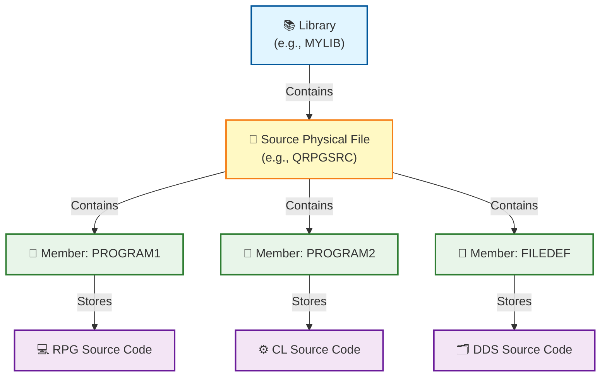

Typical source files:

| Source File | Language |
|-------------|----------|
| QRPGSRC | RPG |
| QCLSRC | CL |
| QCBLSRC | COBOL |
| QDDSSRC | DDS |

## Traditional Development Tools

| Tool | Purpose |
|------|---------|
| PDM | Work with libraries, files, members |
| SEU | Edit source members |
| STRDBG | Debug programs |
| DSPSRC | View source |

## Green Screen Workflow

``` mermaid
flowchart LR
    A["🖥️ Developer Terminal<br/>(5250 Session)"]
    B["📋 PDM<br/>(Programming Development Manager)"]
    C["🔍 Select Source Member"]
    D["✏️ SEU Editor<br/>(Source Entry Utility)"]
    E["💾 Save Member"]
    F["⚙️ Compile Command<br/>(CRTRPGMOD/CRTPGM)"]
    G["📦 *MODULE or *PGM"]
    H["▶️ Run / Debug"]

    A -->|Launch| B
    B -->|Browse| C
    C -->|Edit| D
    D -->|Save| E
    E -->|Execute| F
    F -->|Creates| G
    G -->|Execute| H

    style A fill:#e1f5ff,stroke:#01579b,stroke-width:2px
    style B fill:#fff3e0,stroke:#e65100,stroke-width:2px
    style C fill:#fff9c4,stroke:#f57f17,stroke-width:2px
    style D fill:#fff3e0,stroke:#e65100,stroke-width:2px
    style E fill:#e8f5e9,stroke:#2e7d32,stroke-width:2px
    style F fill:#fff3e0,stroke:#e65100,stroke-width:2px
    style G fill:#e8f5e9,stroke:#2e7d32,stroke-width:2px
    style H fill:#f3e5f5,stroke:#6a1b9a,stroke-width:2px
```

------------------------------------------------------------------------

## Understanding IBM i Access: Two Interconnected Worlds

IBM i provides two distinct yet interconnected interfaces for users and developers:

**Traditional Native Interface (5250/QSYS World):**
- **5250 Telnet Sessions**: Character-based green-screen terminals for interactive work
- **STRSQL**: Native SQL interface running within 5250 sessions
- **Direct QSYS Access**: Work with libraries, objects, and source members using native commands
- **Languages/Runtimes**: ILE (Cobol, RPG, C, CPP, CLP), Java, OPM
- **Use Case**: Traditional IBM i operations, legacy application management, system administration

**Modern Open Interface (PASE/IFS World):**
- **SSH**: Secure shell access to IBM i's Unix-like environment (PASE - Portable Application Solutions Environment)
- **IFS (Integrated File System)**: Unix-style filesystem with standard directories and stream files
- **JDBC/ODBC**: Standard database connectivity for modern applications
- **Bash/Shell**: Unix shell scripting and command-line tools
- **Open Source tools/runtimes**: Node.js, Python, bash, Ruby, Java, PHP, git ... 
- **Use Case**: Modern development, Git integration, CI/CD pipelines, open-source tools

These two worlds coexist on the same system and can interact seamlessly. Modern developers typically use SSH/IFS for source code management and development workflows, while still leveraging 5250 sessions for system administration and traditional operations. 

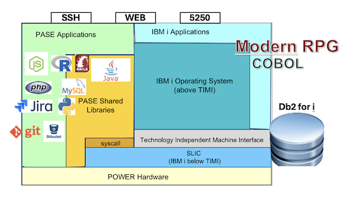

------------------------------------------------------------------------

# 2. RDi (Rational Developer for i)

IBM introduced **RDi**, an Eclipse-based IDE that provides a modern
editor while still working with QSYS source members.

## RDi Workflow

``` mermaid
flowchart LR
    A["💼 RDi Eclipse IDE<br/>(Rational Developer for i)"]
    B["🔗 Remote IBM i Connection<br/>(RSE (Remote System Explorer) / optional SSH)"]
    C["📁 QSYS Source File"]
    D["📄 Member"]
    E["✏️ Edit Source<br/>(Modern Editor)"]
    F["⚙️ Remote Compile<br/>(Automatic)"]
    G["📦 *MODULE / *PGM"]

    A -->|Connect| B
    B -->|Access| C
    C -->|Open| D
    D -->|Edit| E
    E -->|Compile| F
    F -->|Creates| G

    style A fill:#e1f5ff,stroke:#01579b,stroke-width:2px
    style B fill:#e0f2f1,stroke:#00695c,stroke-width:2px
    style C fill:#fff9c4,stroke:#f57f17,stroke-width:2px
    style D fill:#e8f5e9,stroke:#2e7d32,stroke-width:2px
    style E fill:#fff3e0,stroke:#e65100,stroke-width:2px
    style F fill:#fff3e0,stroke:#e65100,stroke-width:2px
    style G fill:#e8f5e9,stroke:#2e7d32,stroke-width:2px
```

Key improvements: - Syntax highlighting - Code navigation - Outline
view - Remote debugging

------------------------------------------------------------------------

# 3. Modern Development with VS Code

Modern IBM i development uses **VS Code** with the **Code for IBM i**
extensions. 

## Modern Toolchain

| Tool | Purpose |
|------|---------|
| VS Code | Code editor |
| Code for IBM i | IBM i integration extension |
| SSH | Connection to the system |
| IFS | File system used for source |

## Modern Architecture

``` mermaid
flowchart LR
    A["💻 Developer Laptop<br/>(Windows/Mac/Linux)"]
    B["🎨 VS Code<br/>(Visual Studio Code)"]
    C["🔌 Code for IBM i Extension"]
    D["🔐 SSH Connection<br/>(Secure Shell)"]
    E["🖥️ IBM i Server"]
    F["📁 IFS Files<br/>(Integrated File System)"]
    G["📋 QSYS Source Members<br/>(Traditional)"]
    H["⚙️ Compile Commands<br/>(CRTRPGMOD/CRTPGM)"]
    I["📦 *MODULE / *PGM"]

    A -->|Runs| B
    B -->|Uses| C
    C -->|Establishes| D
    D -->|Connects to| E
    E -->|Provides| F
    E -->|Provides| G
    F -->|Execute| H
    G -->|Execute| H
    H -->|Creates| I

    style A fill:#e1f5ff,stroke:#01579b,stroke-width:2px
    style B fill:#e1f5ff,stroke:#01579b,stroke-width:2px
    style C fill:#fff3e0,stroke:#e65100,stroke-width:2px
    style D fill:#e0f2f1,stroke:#00695c,stroke-width:2px
    style E fill:#fff9c4,stroke:#f57f17,stroke-width:2px
    style F fill:#e8f5e9,stroke:#2e7d32,stroke-width:2px
    style G fill:#e8f5e9,stroke:#2e7d32,stroke-width:2px
    style H fill:#fff3e0,stroke:#e65100,stroke-width:2px
    style I fill:#e8f5e9,stroke:#2e7d32,stroke-width:2px
```

## Development Approaches

VS Code supports three approaches:

### 1. IFS-Based Development

Store source code in the Integrated File System (IFS).

``` mermaid
flowchart LR
    A["🎨 VS Code"]
    B["📁 IFS Source File<br/>(/home/dev/project/src/)"]
    C["💻 RPG / CL / COBOL Source"]
    D["⚙️ Compile Command<br/>(CRTRPGMOD/CRTSQLRPGI)"]
    E["🧩 *MODULE"]
    F["🔨 Bind<br/>(CRTPGM / CRTSRVPGM)"]

    A -->|Edit| B
    B -->|Contains| C
    C -->|Compile| D
    D -->|Creates| E
    E -->|Bind| F

    style A fill:#e1f5ff,stroke:#01579b,stroke-width:2px
    style B fill:#e8f5e9,stroke:#2e7d32,stroke-width:2px
    style C fill:#f3e5f5,stroke:#6a1b9a,stroke-width:2px
    style D fill:#fff3e0,stroke:#e65100,stroke-width:2px
    style E fill:#fff9c4,stroke:#f57f17,stroke-width:2px
    style F fill:#fff3e0,stroke:#e65100,stroke-width:2px
```

Advantages: - Works like Linux filesystem - Compatible with Git - Easy
CI/CD integration

### 2. QSYS Member Editing

Edit traditional source members directly from VS Code.

``` mermaid
flowchart LR
    A["🎨 VS Code"]
    B["🔌 Code for IBM i<br/>(Extension)"]
    C["📚 QSYS Library"]
    D["📁 Source File<br/>(QRPGSRC)"]
    E["📄 Member"]
    F["✏️ Edit Source"]
    G["⚙️ Compile<br/>(Remote Execution)"]

    A -->|Uses| B
    B -->|Connects to| C
    C -->|Contains| D
    D -->|Contains| E
    E -->|Edit| F
    F -->|Execute| G

    style A fill:#e1f5ff,stroke:#01579b,stroke-width:2px
    style B fill:#fff3e0,stroke:#e65100,stroke-width:2px
    style C fill:#e1f5ff,stroke:#01579b,stroke-width:2px
    style D fill:#fff9c4,stroke:#f57f17,stroke-width:2px
    style E fill:#e8f5e9,stroke:#2e7d32,stroke-width:2px
    style F fill:#fff3e0,stroke:#e65100,stroke-width:2px
    style G fill:#fff3e0,stroke:#e65100,stroke-width:2px
```

### 3. Local Development with Synchronization

Keep source locally and synchronize with IBM i (common with Git).

``` mermaid
flowchart LR
    A["💾 Local Files<br/>(Developer Machine)"]
    B["🔀 Git Repository<br/>(Version Control)"]
    C["🎨 VS Code"]
    D["🔄 Synchronization Tool<br/>(rsync/SFTP/Extension)"]
    E["📁 IFS or QSYS<br/>(IBM i Storage)"]
    F["⚙️ Compile on IBM i<br/>(Remote Build)"]
    G["📦 *MODULE / *PGM"]

    A -->|Commit| B
    B -->|Clone/Pull| C
    C -->|Deploy| D
    D -->|Upload| E
    E -->|Execute| F
    F -->|Creates| G

    style A fill:#e1f5ff,stroke:#01579b,stroke-width:2px
    style B fill:#e0f2f1,stroke:#00695c,stroke-width:2px
    style C fill:#e1f5ff,stroke:#01579b,stroke-width:2px
    style D fill:#fff3e0,stroke:#e65100,stroke-width:2px
    style E fill:#e8f5e9,stroke:#2e7d32,stroke-width:2px
    style F fill:#fff3e0,stroke:#e65100,stroke-width:2px
    style G fill:#e8f5e9,stroke:#2e7d32,stroke-width:2px
```

Benefits: - Git integration - Branching workflows - Pull requests -
CI/CD pipelines

------------------------------------------------------------------------

# 4. IBM i Compilation: OPM vs ILE

Understanding how IBM i compiles programs is essential for effective
development. IBM i supports two compilation models: **OPM (Original
Program Model)** and **ILE (Integrated Language Environment)**.

## 4.1 OPM Compilation Model (Simple but Limited)

In OPM, compilation is done in a single step:

> Source → Program (\*PGM)

### Key Characteristics

-   One source = one program
-   No modularity
-   Limited reuse
-   Simple and fast

### Example Commands

-   RPG: `CRTRPGPGM`
-   CL: `CRTCLPGM`
-   COBOL: `CRTCBLPGM`

### OPM Compilation Flow

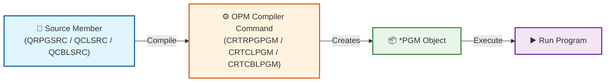

**Explanation:** The compiler directly creates an executable program
object (\*PGM) from the source.

------------------------------------------------------------------------

## 4.2 ILE Compilation Model (Modern Approach)

ILE introduces modularity and binding.

> Source → Module → Program/Service Program

### ILE Core Concepts

🧩 \*MODULE - Compiled unit (not executable) - Created from
source

📦 \*PGM - Executable program - Built from modules

📚 \*SRVPGM (Service Program) - Reusable procedures (like Windows DLL)

📋 \*BNDDIR (Binding Directory) - List of service programs/modules used during binding

### ILE Compilation Flow (General)

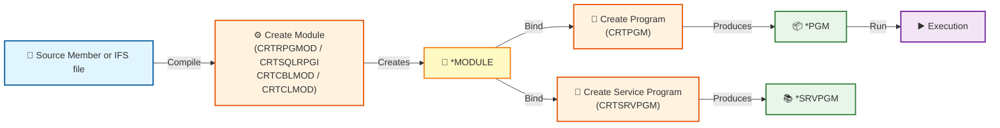

**Explanation:** 1. Compile source into a module (*MODULE) 2. Bind
modules into: - a program (*PGM) - or a service program (\*SRVPGM)

### Language-Specific Module Creation

| Language | Command |
|----------|---------|
| RPG | `CRTRPGMOD` |
| SQL RPG | `CRTSQLRPGI` |
| COBOL | `CRTCBLMOD` |
| CL | `CRTCLMOD` |

------------------------------------------------------------------------

## 4.3 Binding Concepts

Binding connects modules and service programs together.

### Option 1: Explicit Binding (Manual)

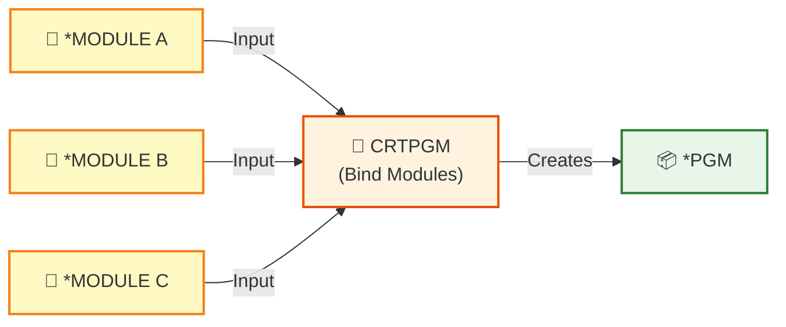

Example:

``` bash
CRTPGM PGM(MYLIB/MYPGM) MODULE(MYLIB/MODA MYLIB/MODB)
```

### Option 2: Using Binding Directory (\*BNDDIR)

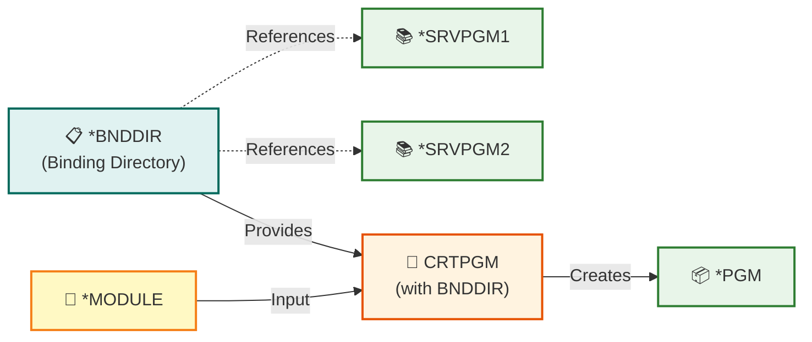

A binding directory (\*BNDDIR) on IBM i is an object that stores a list
of service programs and modules that the system searches during the
program binding process to resolve procedure references.

What it contains:

-   References to service programs (\*SRVPGM)
-   References to modules (\*MODULE)
-   The ordered list used by the binder to locate exported procedures
    during CRTPGM or CRTSRVPGM.

In simple terms: A \*BNDDIR is like a dependency list used at
compile/bind time to automatically locate reusable procedures from
service programs and modules.

Example:

``` bash
CRTPGM PGM(MYLIB/MYPGM)
       MODULE(MYLIB/MOD1)
       BNDDIR(MYLIB/MYBNDDIR)
```

------------------------------------------------------------------------

## 4.4 Service Programs (Reusable Code)

Service programs allow sharing procedures across programs.

### Creation Flow

``` mermaid
flowchart LR
    A["📄 Source Members"]
    B["⚙️ Create Modules<br/>(CRTRPGMOD / CRTCBLMOD)"]
    C["🧩 *MODULE(s)"]
    D["🔨 CRTSRVPGM<br/>(Create Service Program)"]
    E["📚 *SRVPGM"]
    F["🔗 Used by Programs<br/>via Binding"]

    A -->|Compile| B
    B -->|Creates| C
    C -->|Bind| D
    D -->|Produces| E
    E -->|Linked to| F

    style A fill:#e1f5ff,stroke:#01579b,stroke-width:2px
    style B fill:#fff3e0,stroke:#e65100,stroke-width:2px
    style C fill:#fff9c4,stroke:#f57f17,stroke-width:2px
    style D fill:#fff3e0,stroke:#e65100,stroke-width:2px
    style E fill:#e8f5e9,stroke:#2e7d32,stroke-width:2px
    style F fill:#f3e5f5,stroke:#6a1b9a,stroke-width:2px
```

Example:

``` bash
CRTSRVPGM SRVPGM(MYLIB/MYSRV)
          MODULE(MYLIB/MOD1 MYLIB/MOD2)
          EXPORT(*ALL)
```

------------------------------------------------------------------------

## 4.5 Binder Source (Export Control)

Binder source defines the **public interface of a service program**.

It specifies which procedures inside the service program are **exported
and callable by other programs**.

In other words, binder source defines the **API of the service
program**.

Binder source is typically stored in a source file such as:

    QSRVSRC

and is used when creating a service program with:

    CRTSRVPGM

------------------------------------------------------------------------

### Example Binder Source

    STRPGMEXP PGMLVL(*CURRENT)
      EXPORT SYMBOL('calculateTax')
      EXPORT SYMBOL('getCustomer')
    ENDPGMEXP

Meaning:

-   start defining exported procedures
-   make procedures available to other programs
-   finish the export definition

------------------------------------------------------------------------

### Why Binder Source Exists

Binder source allows developers to:

-   define a **stable API**
-   control which procedures are **public**
-   maintain **backward compatibility** between service program versions

Programs compiled against older interfaces can continue to run even if
the service program evolves.

------------------------------------------------------------------------

### Simplified View

    Service Program
     ├─ internalProc1   (private)
     ├─ internalProc2   (private)
     ├─ calculateTax    (exported)
     └─ getCustomer     (exported)

Binder source defines which procedures are **exported**.

------------------------------------------------------------------------

### Learn More

Binder language supports additional features such as:

-   export signatures
-   interface versioning
-   compatibility levels

For a detailed explanation see:

https://programmers.io/ibmi-ebooks/binder-language/


### Flow

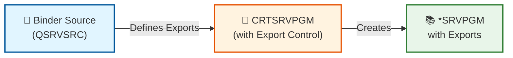

Example:

``` text
STRPGMEXP PGMLVL(*CURRENT)
  EXPORT SYMBOL('myProcedure')
ENDPGMEXP
```

------------------------------------------------------------------------

## 4.6 RTVBNDSRC (Retrieve Binding Source)

Retrieve binder source from an existing service program.


Example:

``` bash
RTVBNDSRC SRVPGM(MYLIB/MYSRV)
          SRCFILE(MYLIB/QSRVSRC)
```


------------------------------------------------------------------------

## 4.7 IFS-Based Compilation

Compile directly from IFS files instead of source members.

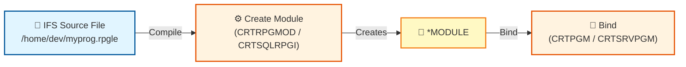

------------------------------------------------------------------------

## 4.8 OPM vs ILE Summary

| Feature | OPM | ILE |
|---------|-----|-----|
| Compilation | One step | Multi-step |
| Modules | ❌ | ✅ |
| Reusability | ❌ | ✅ |
| Service Programs | ❌ | ✅ |
| Binding Directory | ❌ | ✅ |
| Flexibility | Low | High |

------------------------------------------------------------------------

## 4.9 Final Mental Model

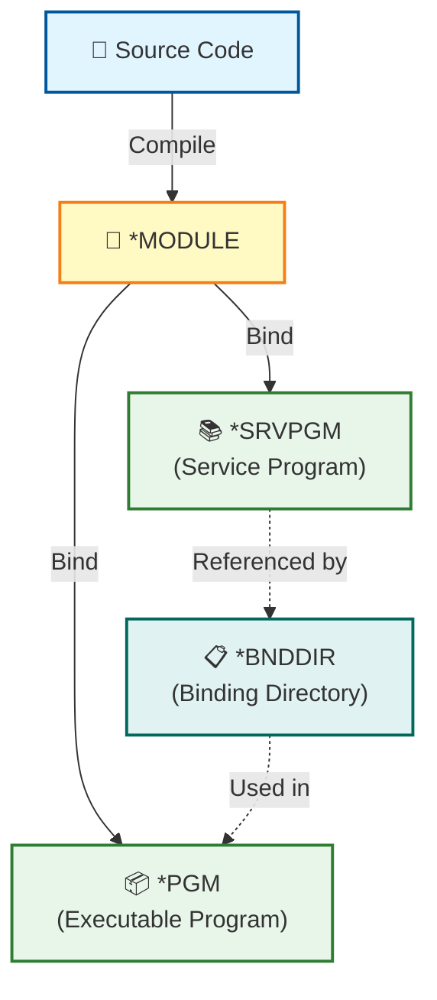

### Core Workflow to Remember

1.  `CRTxxxMOD` → create module
2.  `CRTSRVPGM` → create reusable service program
3.  `CRTPGM` → create executable program
4.  `BNDDIR` → manage dependencies
5.  `RTVBNDSRC` → inspect bindings

------------------------------------------------------------------------

# 5. Source Code Management (SCM) on IBM i

Source code management on IBM i has evolved from basic native
capabilities to sophisticated third-party solutions that enable modern
DevOps practices.

## Native IBM i SCM Capabilities

IBM i provides basic source management through its native commands and
features.

### Native SCM Commands

| Command | Purpose |
|---------|---------|
| `SAVOBJ` | Save objects to save files |
| `RSTOBJ` | Restore objects from save files |
| `CHGOBJD` | Change object description (track changes) |
| `DSPOBJD` | Display object description (view metadata) |
| `CMPPFM` | Compare physical file members |

### Traditional SCM Workflow

``` mermaid
flowchart LR
    A["📄 Source Member<br/>(Development)"]
    B["💾 SAVOBJ<br/>(Save to Save File)"]
    C["📦 Save File<br/>(SAVF)"]
    D["🔄 Transfer<br/>(FTP/Network)"]
    E["📥 RSTOBJ<br/>(Restore)"]
    F["📄 Source Member<br/>(Production)"]

    A -->|Backup| B
    B -->|Creates| C
    C -->|Move| D
    D -->|Deploy| E
    E -->|Restores| F

    style A fill:#e1f5ff,stroke:#01579b,stroke-width:2px
    style B fill:#fff3e0,stroke:#e65100,stroke-width:2px
    style C fill:#fff9c4,stroke:#f57f17,stroke-width:2px
    style D fill:#e0f2f1,stroke:#00695c,stroke-width:2px
    style E fill:#fff3e0,stroke:#e65100,stroke-width:2px
    style F fill:#e8f5e9,stroke:#2e7d32,stroke-width:2px
```

### Limitations of Native SCM

-   ❌ No version history tracking
-   ❌ No branching or merging capabilities
-   ❌ Limited collaboration features
-   ❌ Manual change tracking
-   ❌ No automated deployment workflows
-   ❌ Difficult rollback procedures

------------------------------------------------------------------------

## Third-Party SCM Solutions

Enterprise IBM i shops typically use specialized SCM tools designed for
IBM i environments.

### Major SCM Solutions

#### 1. Rocket Aldon (Rocket Software)

**Aldon Lifecycle Manager (LMi)** provides comprehensive change
management for IBM i.

**Key Features:** - Change request management - Version control for all
IBM i objects - Automated build and deployment - Approval workflows -
Impact analysis - Rollback capabilities - Audit trails and compliance
reporting

**IDE Integration:** - RDi plugin for seamless integration - VS Code
extension available - Web-based interface

#### 2. ARCAD Software

**ARCAD for DevOps** provides modern DevOps capabilities for IBM i.

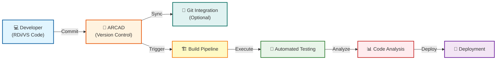

**Key Features:** - Native Git integration - CI/CD pipeline automation -
Code quality analysis - Dependency management - Cross-reference
analysis - Modernization tools (RPG conversion, etc.) - DevOps metrics
and dashboards

**IDE Integration:** - ARCAD RDi plugin - VS Code extension (ARCAD
Transformer/DevOps) - Eclipse-based ARCAD Builder

#### 3. Remain Software (TD/OMS)

**TD/OMS (Turnover for iSeries)** is a mature change management
solution.

**Key Features:** - Object-level version control - Promotion path
management - Automated distribution - Emergency fix procedures -
Comprehensive audit trails

**IDE Integration:** - RDi integration - Green screen interface - Web
interface

#### 4. MIDRANGE Dynamics (MRD)

**MDCMS (Midrange Dynamics Change Management System)**

**Key Features:** - Change request tracking - Version control -
Automated builds - Environment management - Compliance reporting

------------------------------------------------------------------------

## Modern Git-Based Workflows

Modern teams increasingly use Git for IBM i development, especially with
IFS-based source.

### Git + IBM i Tools

Several tools bridge Git and IBM i:

**1. Code for IBM i (VS Code Extension)** - Direct Git integration in VS
Code - Commit and push from IDE - Branch management - Pull request
workflows

**2.Move to Git tools (Arcad, ...)** move QSYS members & dependencies with Git -  Preserves IBM i metadata. 

**3. Bob (IBM's AI Assistant)** - Git-aware development workflows -
Automated commit messages - Code review assistance

------------------------------------------------------------------------

## SCM Comparison

| Feature | Native IBM i | Aldon LMi | ARCAD | Git-Based |
|---------|-------------|-----------|-------|-----------|
| Version Control | Manual | ✅ Full | ✅ Full | ✅ Full |
| Branching | ❌ | Limited | ✅ | ✅ |
| Merging | ❌ | Limited | ✅ | ✅ |
| CI/CD | ❌ | Partial | ✅ | ✅ |
| Change Tracking | Manual | ✅ | ✅ | ✅ |
| Approval Workflows | ❌ | ✅ | ✅ | Via Tools |
| Impact Analysis | ❌ | ✅ | ✅ | Limited |
| Rollback | Manual | ✅ | ✅ | ✅ |
| Audit Trail | Limited | ✅ | ✅ | ✅ |
| Cost | Free | $$$ | $$$ | Free/$ |
| Learning Curve | Low | High | Medium | Medium |

------------------------------------------------------------------------

## IDE Extensions for SCM / Modernization

### RDi Extensions

**1. Aldon Plugin** - Integrated change management - Check-out/check-in
from RDi - Build package creation - Deployment management

**2. ARCAD RDi Plugin** - Version control operations - Code analysis -
Refactoring tools - Git synchronization

**3. TD/OMS Plugin** - Turnover integration - Object promotion - Change
request management

### VS Code Extensions

**1. Code for IBM i** - Native Git support - Source member management -
Compile and deploy - Debug integration

**2. ARCAD / Rocket** - Code modernization - Git integration - Analysis
tools - Refactoring assistance - Comprehensive IBM i support - SCM
integration - Build automation - Testing tools

------------------------------------------------------------------------

## Choosing an SCM Solution

### Migration Path

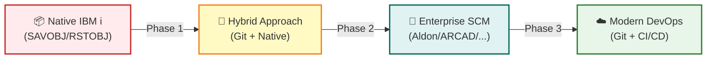

**Recommended Approach:** 1. Start with Git for new IFS-based projects
2. Evaluate third-party tools for existing QSYS code 3. Implement CI/CD
gradually 4. Train team on modern SCM practices 5. Migrate legacy code
incrementally

------------------------------------------------------------------------

------------------------------------------------------------------------

# 6. ILE Debugging

Debugging has evolved from command-line interfaces to modern integrated
debugging.

## Traditional Debugging (STRDBG)

The classic approach uses the **STRDBG** command on a 5250 terminal.

> **Note:** Many debugging actions are performed through the interactive
> debug screen rather than standalone commands. Commands like `BREAK`,
> `STEP`, and variable inspection are typically executed within the
> STRDBG debugging interface.


### Debug Flow

``` mermaid
flowchart LR
    A["🖥️ 5250 Terminal"]
    B["🐛 STRDBG<br/>(Start Debugger)"]
    C["📍 Set Breakpoints<br/>(BREAK command)"]
    D["▶️ Call Program<br/>(CALL PGM)"]
    E["⏸️ Hit Breakpoint"]
    F["🔍 Inspect Variables<br/>(DISPLAY/EVAL)"]
    G["⏭️ Step Through<br/>(STEP/NEXT)"]
    H["✅ End Debug<br/>(ENDDBG)"]

    A -->|Execute| B
    B -->|Configure| C
    C -->|Run| D
    D -->|Stops at| E
    E -->|Examine| F
    F -->|Continue| G
    G -->|Finish| H

    style A fill:#e1f5ff,stroke:#01579b,stroke-width:2px
    style B fill:#fff3e0,stroke:#e65100,stroke-width:2px
    style C fill:#fff9c4,stroke:#f57f17,stroke-width:2px
    style D fill:#e8f5e9,stroke:#2e7d32,stroke-width:2px
    style E fill:#ffebee,stroke:#c62828,stroke-width:2px
    style F fill:#fff3e0,stroke:#e65100,stroke-width:2px
    style G fill:#fff3e0,stroke:#e65100,stroke-width:2px
    style H fill:#e8f5e9,stroke:#2e7d32,stroke-width:2px
```

### Debugging Programs

IBM i programs can be debugged using several tools.

| Method | Tool |
|--------|------|
| Traditional green screen debugger | `STRDBG` |
| Modern IDE debugging | VS Code for IBM i |
| Graphical IDE debugging | RDi |

Programs must be **compiled with debug information** for source‑level
debugging.

Example:

    CRTBNDRPG DBGVIEW(*SOURCE)

## Green Screen Debugging

The traditional debugger is started with the `STRDBG` command.

    STRDBG PGM(MYLIB/MYPROGRAM)

This places the current job in debug mode.

Typical workflow:

1.  Start the debug session\
2.  Run or call the program\
3.  Stop at breakpoints\
4.  Inspect variables\
5.  Step through code

Example:

    STRDBG PGM(MYLIB/ORDPROC)
    CALL ORDPROC

Inside the debugger you can:

| Action | Description |
|--------|-------------|
| Breakpoint | Stop execution at a specific line |
| Step | Execute one statement at a time |
| Display variables | Inspect program data |
| Resume | Continue program execution |

The debugger works with **OPM and ILE programs** within the current job.

Reference:\
https://www.ibm.com/docs/en/ssw_ibm_i_74/cl/strdbg.htm

## Modern Debugging (RDi & VS Code)

Modern IDEs provide graphical debugging with visual breakpoints,
variable inspection, and call stack views.

### VS Code Debug Flow

``` mermaid
flowchart LR
    A["🎨 VS Code"]
    B["🔌 Code for IBM i<br/>(Debug Extension)"]
    C["🔐 SSH Debug Connection"]
    D["🖥️ IBM i Debug Server"]
    E["📦 *PGM / *SRVPGM"]
    F["🐛 Debug Session<br/>(Interactive)"]
    G["📊 Debug Views<br/>(Variables/Call Stack)"]

    A -->|Uses| B
    B -->|Establishes| C
    C -->|Connects to| D
    D -->|Debugs| E
    E -->|Provides| F
    F -->|Updates| G
    G -->|Displays in| A

    style A fill:#e1f5ff,stroke:#01579b,stroke-width:2px
    style B fill:#fff3e0,stroke:#e65100,stroke-width:2px
    style C fill:#e0f2f1,stroke:#00695c,stroke-width:2px
    style D fill:#fff9c4,stroke:#f57f17,stroke-width:2px
    style E fill:#e8f5e9,stroke:#2e7d32,stroke-width:2px
    style F fill:#fff3e0,stroke:#e65100,stroke-width:2px
    style G fill:#fff9c4,stroke:#f57f17,stroke-width:2px
```

Typical workflow:

1.  Compile program with debug information\
2.  Start debugging session\
3.  Set breakpoints in VS Code\
4.  Run the program\
5.  Inspect variables and step through code

VS Code integrates with the IBM i debugging system and provides:

-   graphical breakpoints
-   variable inspection
-   call stack navigation
-   step‑through execution

This provides a modern debugging experience similar to other development
platforms.

### Debug Comparison

| Feature | STRDBG | RDi | VS Code |
|---------|--------|-----|---------|
| Interface | Text-based | Graphical | Graphical |
| Breakpoints | Command-based | Visual | Visual |
| Variable Watch | Manual commands | Automatic | Automatic |
| Call Stack | Text display | Visual tree | Visual tree |
| Source View | Limited | Full | Full |
| Remote Debug | N/A | ✅ | ✅ |
| Learning Curve | Steep | Moderate | Easy |

## Debug Best Practices

**1. Use Debug Views**

Compile with `DBGVIEW(*SOURCE)` for source-level debugging:

``` bash
CRTRPGMOD MODULE(MYLIB/MYMOD) 
          SRCFILE(MYLIB/QRPGLESRC) 
          DBGVIEW(*SOURCE)
```

**2. Conditional Breakpoints**

Set breakpoints that trigger only under specific conditions:

``` bash
BREAK 100 WHEN(customerID = 12345)
```

**3. Debug Multiple Programs**

Debug programs that call other programs:

``` bash
STRDBG PGM(MYLIB/MAINPGM) UPDPROD(*YES)
ADDPGM PGM(MYLIB/SUBPGM1)
ADDPGM PGM(MYLIB/SUBPGM2)
```

**4. Monitor Job Logs**

Always check job logs for additional information:

``` bash
DSPJOBLOG JOB(*) OUTPUT(*PRINT)
```

------------------------------------------------------------------------

# 7. Comparison Summary

| Feature | Green Screen | RDi | VS Code |
|---------|-------------|-----|---------|
| Editor | SEU | Eclipse | VS Code |
| Source Storage | Members | Members | Members / IFS / Local |
| Git Support | ❌ | Limited | ✅ |
| Modern UI | ❌ | Partial | ✅ |
| Extensions | ❌ | Limited | Many |
| Debugging | STRDBG (text) | Graphical | Graphical |
| Remote Work | ❌ | ✅ | ✅ |

------------------------------------------------------------------------

# 8. IBM i Essential Concepts

The following concepts are critical for developers new to IBM i because
they explain **how programs are located, executed, and managed at
runtime**.

## Library List (LIBL)

The **Library List** determines where IBM i looks for objects such as
programs and files.

When a program is called:

    CALL CUSTINQ

IBM i searches libraries in order:

1.  **Current Library**
2.  **User Library List**
3.  **System Library List**

Conceptually this behaves similarly to a **PATH environment variable**
on Linux or Windows.

Without understanding the library list, developers often struggle
with: - programs resolving differently between environments - database
files being found in unexpected libraries - deployment inconsistencies

------------------------------------------------------------------------

## Jobs and Subsystems

IBM i is **job‑centric** rather than process‑centric.

Programs run inside **jobs**, which are managed by **subsystems**.

Typical hierarchy:

    Subsystem
       → Job Queue
            → Job
                 → Program

Types of jobs:

| Job Type | Purpose |
|----------|---------|
| Interactive | User sessions (5250 / SSH / RDi) |
| Batch | Background processing |
| System | OS services |

Understanding jobs helps explain:

-   job logs
-   batch processing
-   debugging sessions

------------------------------------------------------------------------

## Activation Groups

Activation groups control the **runtime lifecycle of ILE programs and
service programs**.

They determine:

-   how programs share memory
-   when service programs are loaded or unloaded
-   when static variables are reset

Example:

    Program A (Activation Group: MYGROUP)
        → calls Service Program B

If the activation group ends:

-   static storage resets
-   service programs unload
-   program state is cleared

Activation groups are a key part of the **ILE execution model**.

------------------------------------------------------------------------

## Object‑Based Architecture

IBM i uses an **object‑based architecture** rather than a purely
file‑based model.

Everything in the system is stored as an object type:

| Object | Purpose |
|--------|---------|
| `*PGM` | Executable program |
| `*SRVPGM` | Service program (shared procedures) |
| `*MODULE` | Compiled code unit |
| `*FILE` | Database or source file |
| `*LIB` | Library container |

Objects include built‑in metadata, security, and lifecycle management
handled by the operating system.

This architecture is one reason IBM i systems are known for **stability
and integrity**.

------------------------------------------------------------------------

# 9. Key Takeaways

## Traditional Development

-   Source stored in **members** (QRPGSRC, QCLSRC, etc.)
-   Edited with **SEU/PDM** on green screen
-   Debugging with **STRDBG** command-line interface
-   Limited integration with modern tools

## Modern Development

-   Uses **VS Code** with Code for IBM i extension
-   Supports **IFS, members, or local files**
-   Integrates with **Git and DevOps workflows**
-   Modern debugging with **visual breakpoints** and **variable
    inspection**
-   Remote debugging capabilities from desktop IDE

## Best Practices

-   Use IFS for new projects to enable Git integration
-   Leverage VS Code & AI with IBM Bob extensions for productivity
-   Implement CI/CD pipelines for automated builds
-   Use service programs for code reusability
-   Expose programs in REST with IWS/IAS Application Servers on IBM i

------------------------------------------------------------------------
