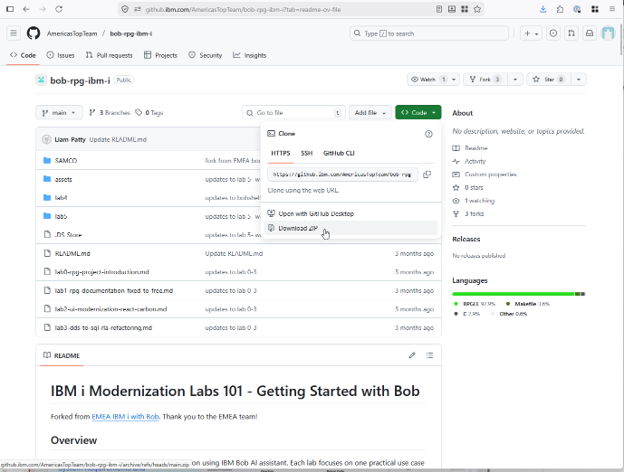
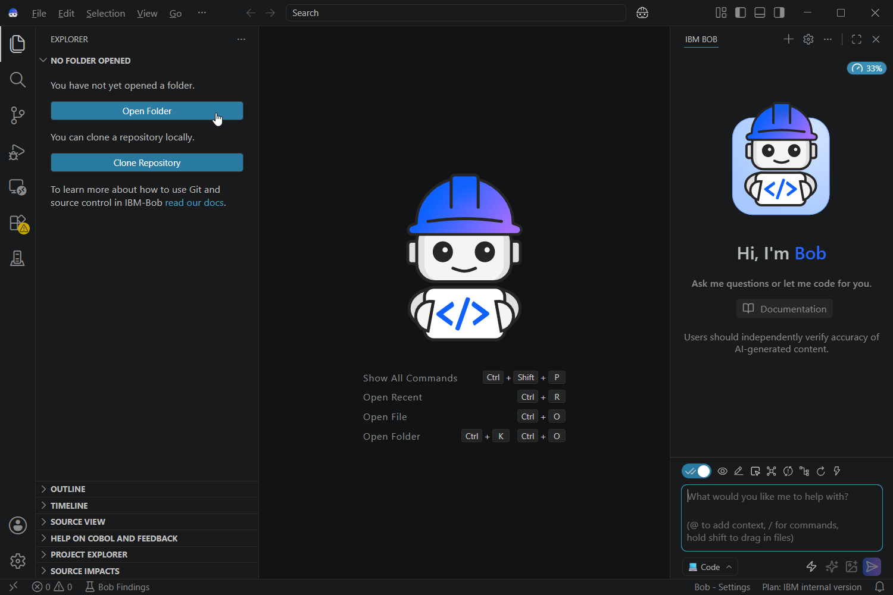
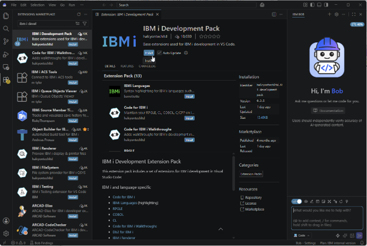
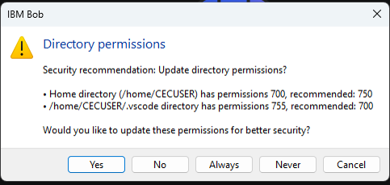
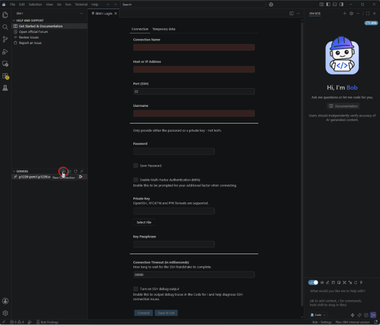

**[IBM i Modernization Labs 101 - Environment Setup]{.underline}**

1.  Download and install Bob IDE (VS Code-based).

2.  Launch Bob IDE and sign in with your IBM ID --- if you don\'t have an account, create an account.

3.  Download or clone this github repo:
<[https://github.com/lobranden/IBM-i-Application-Modernization-with-Bob/tree/main](https://github.com/lobranden/IBM-i-Application-Modernization-with-Bob/tree/main)>

4.  Extract files to your local drive

5. Start "IBM Bob"

6. Select "Open Folder" to open the folder where you extracted the files.

**Steps shown below are optional.**

7.  Install \"IBM i Development Pack\" extension from the VS Code Marketplace

8.  Establish the connection to your IBM i this is a standard connection to your IBM i.

9.  You can click \"No\" to skip this warning message.

10.  Configure Bob for IBM i access

