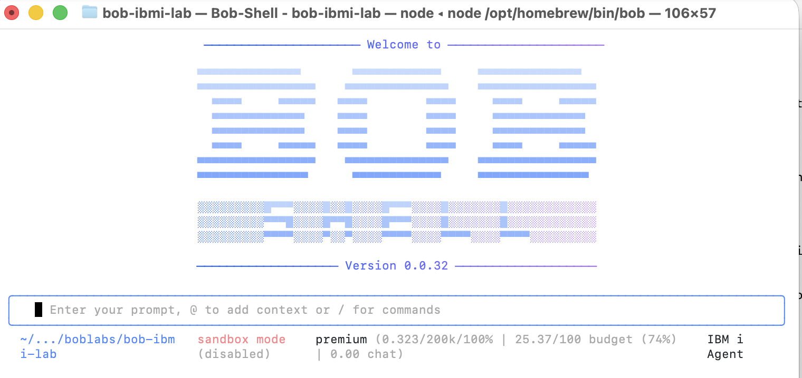
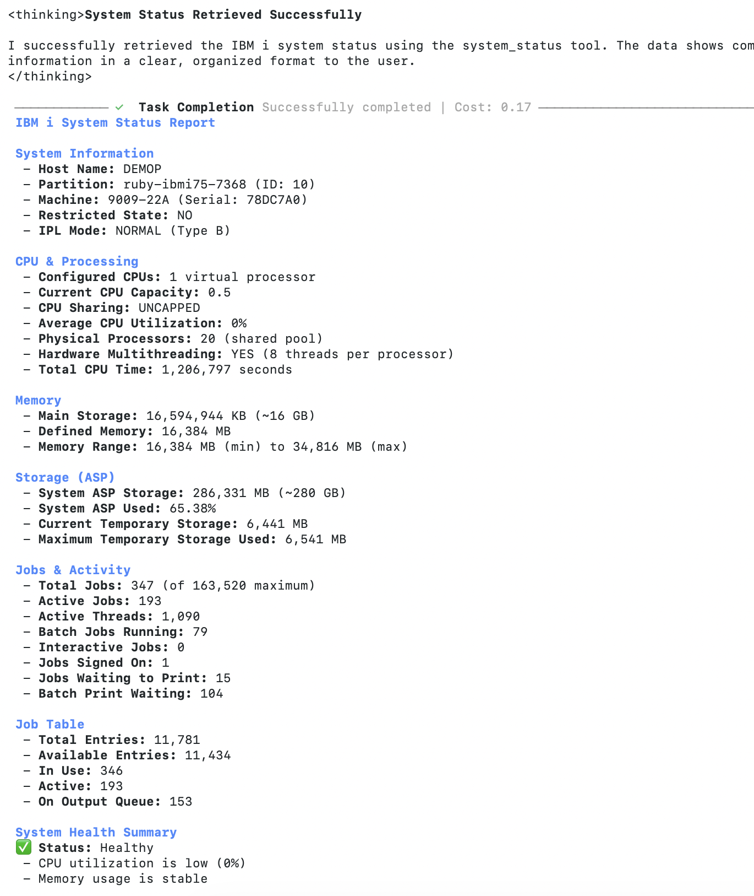

# Lab 101-4: IBM i modes, IBM i MCP, Bob Shell - 15 Minute Hands-On Lab

**Duration**: 15 minutes  
**Level**: Intermediate  
**Prerequisites**: 
- IBM Bob installed and running
- Access to an IBM i system with Mapepire server running (port 8076)
- Basic familiarity with command line
**Version:** version 3 updated on May 8, 2026

## Lab Overview

In this hands-on lab, you'll configure IBM Bob to work with IBM i systems using the Model Context Protocol (MCP). You'll set up custom modes, connect to your IBM i system, and execute your first queries using Bob's AI-powered interface, enabling Bob (AI agent) to interact with IBM i databases, execute SQL queries, and access system services through the Model Context Protocol (MCP).

The *IBM Bob premium package for IBM i* available at GA will bring standard IBM i modes and tools that will differ from the ones used in this tutorial. 

> **Note:** For a comprehensive guide covering both local and remote MCP server deployments, see [`lab4-ibmi-mcp-setup-guide.md`](lab4-ibmi-mcp-setup-guide.md). This lab focuses on the remote IBM i deployment scenario. 

> **Note:** Please refer to the [MCP Server for IBM i repository](https://github.com/IBM/ibmi-mcp-server) for more information. 

## What is MCP?

The **Model Context Protocol (MCP)** is an open protocol that standardizes how AI applications interact with external data sources and tools. Think of it as a universal adapter that allows AI agents like Bob to:

- **Access Data Sources** - Connect to databases, APIs, and file systems
- **Execute Tools** - Run SQL queries, system commands, and custom operations
- **Maintain Context** - Keep track of conversation state and data across interactions

### Key MCP Concepts

1. **MCP Server** - A service that exposes tools and resources to AI agents
2. **Transport** - Communication method (HTTP for remote, Stdio for local)
3. **Tools** - Executable operations (SQL queries, system commands)
4. **Resources** - Data sources (databases, files, APIs)
5. **Authentication** - Security layer (tokens, credentials)


## Prerequisites (15 minutes)

Before starting, ensure you have:

- ✅ Access to an IBM i system with SSH access
- ✅ IBM i user profile with appropriate database authorities
- ✅ Bob IDE installed
- ✅ Basic understanding of IBM i and SQL

An IBM i VM is necessary for this lab, with 8076 port open for Mapepire server (use tunneling if using Power Virtual Server/TechZone). You'll find hereunder a few options to get an IBM i virtual machine, and instructions to start the Mapepire server on IBM i that is requried for this lab.

In this lab, we'll use the following setup:

```
┌─────────────────────────────┐
│   Your Workstation          │
│                             │
│  ┌─────────────────────┐    │
│  │   Bob IDE / Shell   │    │
│  │   (AI Agent)        │    │
│  └──────────┬──────────┘    │
│             │               │
│             │ HTTPS         │
│             │ Bearer Token  │
└─────────────┼───────────────┘
              │
              ▼
┌─────────────────────────────┐
│   IBM i System              │
│                             │
│  ┌─────────────────────┐    │
│  │  MCP Server         │    │
│  │  (Node.js/HTTP)     │    │
│  │  Port 3010          │    │
│  └──────────┬──────────┘    │
│             │               │
│             ▼               │
│  ┌─────────────────────┐    │
│  │  Mapepire           │    │
│  │  (WebSocket)        │    │
│  │  Port 8076          │    │
│  └──────────┬──────────┘    │
│             │               │
│             ▼               │
│  ┌─────────────────────┐    │
│  │  Db2 for i          │    │
│  │  (Database)         │    │
│  └─────────────────────┘    │
└─────────────────────────────┘
```

**Key Components:**
- **Bob** - AI agent that sends requests to MCP server
- **MCP Server** - Runs on IBM i, exposes SQL tools via HTTP
- **Mapepire** - Database server that executes SQL queries
- **Db2 for i** - IBM i database system

### How to get an IBM i virtual machine (aka LPAR)? 

* For customer activities: 
    * use customer infrastructure (IBM on prem or in the Cloud)
    * TechZone: request an [IBM i on IBM Cloud Power Virtual Server](https://techzone.ibm.com/collection/628be988043b54001f89111f) with ssh tunneling (see instructions [here](https://cloud.ibm.com/docs/power-iaas?topic=power-iaas-connect-ibmi#ssh-tunneling) for opening ports if using a public IP. Note that no 'production' customer data is allowed when using our own IBM accounts. Please refer to the official guidelines.
    * TechZone: request a custom techZone environment for complex or more permanent showcase (prefered but not the default). 
* For IBMers/business partners activities:
    * TechZone: request a ["On-Premises IBM Power AIX, IBM i and Linux Base Images"](https://techzone.ibm.com/collection/6261d3584670d7001e3d483a) environment, for example IBM i 7.5 on Power10. IBMers must connect through the Internal intranet and Business partners must connect through a provided VPN.
    * TechZone: request a [IBM i on IBM Cloud Power Virtual Server](https://techzone.ibm.com/collection/628be988043b54001f89111f) as listed above.


## Part 1: MCP Server Quick Setup on IBM i 

Skip this Part if your MCP server is already running.

### Step 1: Install Prerequisites on IBM i
```bash
# If not installed, use yum to install Node.js 20+
yum install nodejs22

# Verify installation
node --version  # Should show v20.x.x or higher

# Check if git is installed
git --version

# If not installed
yum install git
```

### Step 2: Install & Start mapepire service on IBM i (used by MCP server)

Follow these [instructions](https://ibm-d95bab6e.mintlify.app/setup-mapepire#option-1-rpm-installation-recommended) and don't be scared.
In a nutshell: 
1. connect to your IBM i with [Access Client Solution](https://www.ibm.com/support/pages/ibm-i-access-client-solutions) (5250 emulator) and your user profile.
2. start SSH using the CL command `STRTCPSVR *SSHD` , 
3. connect with ssh and you user profile, then execute the commands :
    - ``/QOpenSys/pkgs/bin/yum install mapepire-server``
    - ``/QOpenSys/pkgs/bin/yum install service-commander``
    - ``/QOpenSys/pkgs/bin/sc start mapepire``

### Step 3: Install MCP tools on IBM i

You can create your own tools, use tools from the IBM i MCP repository, or use the IBM i MCP Server [built-in tools](https://ibm-d95bab6e.mintlify.app/sql-tools/built-in-tools). 
In this lab, let's firt use the built-in tools and go directly to the next step. 

> **Note:** For copying tools from the repository (`tools` directory): 
```bash
# From you HOME directory in PASE, Clone the IBM i MCP Server repository
git clone https://github.com/IBM/ibmi-mcp-server.git 
```

### Step 4: Configure MCP Server

In PASE, create a `.env` file with your configuration:

```bash
cat > .env << 'EOF'
# IBM i Connection
DB2i_HOST=localhost
DB2i_PORT=8076
DB2i_IGNORE_UNAUTHORIZED=true
DB2i_USER=<YOUR-USER>
DB2i_PASS=<YOUR-PASSWORD>

# Server Configuration
MCP_TRANSPORT_TYPE=http
MCP_HTTP_PORT=3010
MCP_LOG_LEVEL=info

# For development/testing - allow HTTP
# For production, set to false and use HTTPS
IBMI_AUTH_ALLOW_HTTP=true

# If using custom tools - not the case if using built-in
# TOOLS_YAML_PATH=./tools

EOF
```
**Important Notes:**
- `DB2i_HOST=localhost` because Mapepire runs on the same IBM i system
-  `DB2i_USER`and `DB2i_PASS` must be set (OS credentials used by the tools)
- `DB2i_PORT=8076` is the default Mapepire port
- `MCP_HTTP_PORT=3010` is the port where MCP server will listen
- For production, set `IBMI_AUTH_ALLOW_HTTP=false` and configure HTTPS with authentication !! 

### Step 5: Start the MCP Server

The repository includes pre-built SQL tools in the `tools/` directory. Start the server to load all available tools:

```bash
# Set configuration file path
export MCP_SERVER_CONFIG=.env && npx -y @ibm/ibmi-mcp-server@latest --transport http --builtin-tools
```

### Step X: Networking setup if your IBM i traffic is filtered

For example, if using a TechZone [IBM i on IBM Cloud Power Virtual Server](https://techzone.ibm.com/collection/628be988043b54001f89111f), only HTTPS and SSH are exposed on specific ports and you must create the ssh tunnel between your workstation (mcp client) and the IBM i (mcp server).  

Use the following command on your Linux/MacOS laptop (for Windows, please use the reference [here](https://cloud.ibm.com/docs/power-iaas?topic=power-iaas-connect-ibmi#ssh-tunneling)) where all the protocols you want to use are passed in the ssh tunnel : 

````bash 
ssh -L 50000:localhost:23 -L 2001:localhost:2001  -L 449:localhost:449 -L 8470:localhost:8470 -L 8471:localhost:8471 -L 8472:localhost:8472 -L 2007:localhost:2007 -L 8473:localhost:8473 -L 8474:localhost:8474 -L 8475:localhost:8475 -L 8476:localhost:8476 -L 2003:localhost:2003 -L 2002:localhost:2002 -L 2006:localhost:2006 -L 2300:localhost:2300 -L 2323:localhost:2323 -L 3001:localhost:3001 -L 3002:localhost:3002 -L 2005:localhost:2005 -L 8076:localhost:8076 -L 3010:localhost:3010 -o ExitOnForwardFailure=yes -o ServerAliveInterval=15 -o ServerAliveCountMax=3 <myuser>@<myIPaddress>
````
> **Note:** In the command above, port 8076 is the default **mapepire** port. If you have changed it, please update it accordingly. This port is not used when running MCP on IBM i. 
> **Note:** In the command above, port 3010 is the default **MPC server** port. If you have changed it, please update it accordingly.
> **Note:** Replace `<myuser>` and `<myIPaddress>` with your IBM i user and IP address.


## Part 2 : Lab Setup in Bob (5 minutes)

### Step 1: Open project

If not already done, Open up your project new Bob window, this is the participant working directory.

### Step 2: Update MCP Configuration

Edit `.bob/mcp.json` to use the `.env` file (remove credential references in any):
We use `IBMi_IP` is `localhost` as it we use the ssh tunnel and IBM on Power Virtual Server. Please replace the IP address with the correct value. 

```json
{
    "mcpServers": {
        "ibmi-mcp-server": {
            "type": "streamable-http",
            "url": "http://<IBMi_IP>:3010/mcp"
        },
        "ibmi-mcp-docs": {
            "type": "streamable-http",
            "url": "https://ibm-d95bab6e.mintlify.app/mcp",
            "alwaysAllow": []
        }
    }
}
```

#### MCP running on your workstation - example
```json
{
    "mcpServers": {
        "ibmi-mcp-server": {
            "command": "npx",
            "args": [
                "@ibm/ibmi-mcp-server",
                "--tools",
                "${workspaceFolder}/.bob/tools"
            ],
            "cwd": "${workspaceFolder}",
            "env": {
                "NODE_OPTIONS": "--no-deprecation --no-warnings",
                "MCP_TRANSPORT_TYPE": "stdio",
                "YAML_ALLOW_DUPLICATE_SOURCES": "true"
            },
            "disabled": false,
            "alwaysAllow": []
        },
        "ibmi-mcp-docs": {
            "type": "streamable-http",
            "url": "https://ibm-d95bab6e.mintlify.app/mcp"
        }
    }
}
```

### Step 4: Check configuration

1. Restart Bob (or reload the window using `Function` + `F1` keys then `Reload Window`  )
2. Open up Bob settings
3. Check that `ibmi-mcp-server` and `ibmi-mcp-docs` appear connected in your MCP list
4. Click on `ibmi-mcp-server`, check the list of tools exposed. 

## Exercise 1: Swith to a mode, and query System Status (3 minutes)

**Objective**: Select the IBM i-specific AI agent, Use Bob to check your IBM i system's performance.

1. Switch to a mode that can use MCP tools - Advanced or other: 


Note that you can create your own modes. For example, import in your .bob directory 2 custom modes extracted from these [examples](https://github.com/IBM/ibmi-mcp-server/blob/main/.bob/custom_modes.yaml). Once the modes created, Bob should be able to use them. Switch to the `ÌBM i agent`mode.

2. Ask Bob: `"Show me the current system status"`
3. Bob should execute the `system_status` tool and display:
   - CPU utilization
   - Memory usage
   - I/O statistics
   - Active jobs count

**Sample Questions to Try**:
- `"What is the current CPU usage?"`
- `"How many jobs are currently active?"`
- `"Show me memory pool information"`

**✅ Success Criteria**: Bob returns formatted system performance data from your IBM i system.

## Exercise 2: Explore Database Objects (3 minutes)

**Objective**: Use Bob to explore your IBM i database.

1. Ask Bob: `"List all service categories available on IBM i"`
2. Bob should show categories like "System Administration", "Performance", "Security", etc.
3. Ask Bob: `"Search for services related to 'job' in their name"`
4. Bob should list job-related SQL services

**Sample Questions to Try**:
- `"What services are available in the Performance category?"`
- `"Show me an example of using the ACTIVE_JOB_INFO service"`
- `"List tables in the QSYS2 schema"`

**✅ Success Criteria**: Bob successfully queries and displays IBM i service information.

## Exercise 3: Security Analysis (Optional - 2 minutes)

**Objective**: Use Bob to perform a basic security check.

1. Ask Bob: `"Show me users with limited capabilities"`
2. Bob should execute the security tool and display results
3. Ask Bob: `"Are there any database files readable by any user?"`

**⚠️ Note**: These queries require appropriate security authorities on your IBM i system.

**✅ Success Criteria**: Bob executes security analysis tools and returns results (or explains permission requirements).

## Exercise 4: Creating Custom Tools


You can create your own SQL tools by adding YAML files to the `tools/` directory on IBM i. 

**Example Custom Tool:**

On IBM i , Create `tools/custom/my-tools.yaml`:

```yaml
sources:
  ibmi-system:
    host: ${DB2i_HOST}
    user: ${DB2i_USER}
    password: ${DB2i_PASS}
    port: 8076
    ignore-unauthorized: true

tools:
  get_customer_orders:
    source: ibmi-system
    description: "Get all orders for a specific customer"
    parameters:
      - name: customer_id
        type: string
        description: "Customer ID"
        required: true
    statement: |
      SELECT o.ORDER_ID, o.ORDER_DATE, o.ORDER_AMOUNT, c.CUSTOMER_NAME
      FROM ORDERS o
      JOIN CUSTOMERS c ON o.CUSTOMER_ID = c.CUSTOMER_ID
      WHERE c.CUSTOMER_ID = ?
      ORDER BY o.ORDER_DATE DESC

toolsets:
  custom:
    tools:
      - get_customer_orders
```

Restart the MCP server to load the new tools:

```bash
export MCP_SERVER_CONFIG=.env && npx -y @ibm/ibmi-mcp-server@latest --transport http --tools ./tools
```

## Exercise 4: (optional) Using Bob Shell (3 minutes)

**Objective**: Learn to use Bob from the command line for general IBM i assistance.

Bob provides a CLI, **Bob Shell** that allows you to interact with AI agents from the terminal, making it perfect for quick questions, code generation, and documentation lookup.


### Step 1: Verify Bob CLI is Available

Check if Bob CLI is installed:

```bash
bob --version
```

If not installed, follow the Bob CLI installation instructions for your platform.

### Step 2: Update MCP Configuration for CLI

Bob CLI can require a few changes in the MCP configuration. Update your `.bob/mcp.json` : 

1. **Find the full path to npx**:
```bash
which npx
# Example output: /opt/homebrew/bin/npx
```

2. **Get the full path to your project directory**:
```bash
pwd
# Example output: /Users/yourname/bob-ibmi-lab
```

3. **Update `.bob/mcp.json`** with full paths. 

There are certainly more elegant ways to do that, but for now, just update the file as follows:

```json
{
    "mcpServers": {
        "ibmi-mcp-server": {
            "command": "/opt/homebrew/bin/npx",
            "args": [
                "@ibm/ibmi-mcp-server",
                "--tools",
                "/Users/yourname/bob-ibmi-lab/.bob/tools"
            ],
            "cwd": "/Users/yourname/bob-ibmi-lab",
            "env": {
                "NODE_OPTIONS": "--no-deprecation --no-warnings",
                "MCP_TRANSPORT_TYPE": "stdio",
                "YAML_ALLOW_DUPLICATE_SOURCES": "true",
                "DB2i_HOST": "your-ibmi-hostname.com",
                "DB2i_USER": "YOURUSER",
                "DB2i_PASS": "yourpassword",
                "DB2i_PORT": "8076"
            },
             "disabled": true,
            "timeout": 120,
            "alwaysAllow": []
        },
        "ibmi-mcp-server-http": {
            "type": "streamable-http",
            "url": "http://localhost:3010/mcp"
        },
        "ibmi-mcp-docs": {
            "type": "streamable-http",
            "url": "https://ibm-d95bab6e.mintlify.app/mcp"
        }
    }
}
```
**Important**: Add `mcp.json` to `.gitignore`:

```bash
echo ".bob/mcp.json" >> .gitignore
```

**Important**: Replace `/opt/homebrew/bin/npx` and `/Users/yourname/bob-ibmi-lab` with your actual paths.

### Step 3: Check Available Modes

Verify that Bob CLI can see your custom modes:

```bash
bob mcp list
```

You should see:
- `loaded project modes [ 'ibm-i-agent', 'ibmi-mcp-tool-builder' ]`
- MCP servers listed (may show as disconnected in CLI)

### Step 4: Use Bob Shell with IBM i Agent Mode

Launch Bob shell and interact with IBM i using the custom mode:

1. **Start Bob shell**:
```bash
bob 
```



2. **Switch to advanced mode**:
```
Switch to advanced mode with   /mode advanced , press enter
```
Bob should confirm the mode switch.

3. **Run a query in advanced mode**:
```
Show me the current system status
```

Bob should execute the `system_status` tool and display comprehensive IBM i system information including CPU, memory, jobs, and storage statistics.

4. **Exit Bob shell**:
```
Exit Bob shell with Ctrl+C Ctrl+C
```

**✅ Success Criteria**:
- Bob shell launches successfully
- Successfully switch to IBM i Agent mode
- Execute queries and receive IBM i system data
- Understand the difference between shell (interactive) and CLI (one-shot) usage

### Step 5: Run Live IBM i Queries from Command Line

With the MCP server connected, you can now run live queries against your IBM i system:

```bash
# System status (MCP tools work in any mode)
bob -p "Show me the current system status" --chat-mode advanced

# Active jobs
bob -p "Show me the top 5 CPU consumers" --chat-mode advanced

# Database exploration
bob -p "List tables in the SAMPLE schema" --chat-mode advanced

# Security checks
bob -p "Show me users with limited capabilities" --chat-mode advanced
```

**Important Notes:**
- Use `--chat-mode ask` for queries and `--chat-mode code` for code generation



### CLI Options Reference

Common Bob CLI options:
- `--chat-mode <mode>` - Specify chat mode: `plan`, `code`, `ask`, or `advanced`
- `--hide-intermediary-output` - Suppress extra output, show only final results
- `--max-coins <number>` - Set maximum cost limit (exits with code 1 if exceeded)
- `--help` - Show all available options

**✅ Success Criteria**: Successfully execute queries from the command line and understand CLI capabilities and limitations.

## Lab Completion Checklist

- [ ] Bob is configured with IBM i custom modes
- [ ] MCP servers are connected and working
- [ ] Successfully switched to IBM i Agent mode
- [ ] Retrieved system status information
- [ ] Explored IBM i services and database objects
- [ ] (Optional) Ran security analysis queries
- [ ] Used Bob CLI from the command line

## What You've Accomplished

Congratulations! You've successfully:

1. ✅ Configured IBM Bob for IBM i development
2. ✅ Connected Bob to your IBM i system via MCP
3. ✅ Used natural language to query IBM i system information
4. ✅ Explored IBM i SQL services and database objects
5. ✅ Leveraged pre-built tools for system monitoring
6. ✅ Automated IBM i queries using Bob CLI

## Next Steps   

### Create Custom Tools

Switch to IBM i MCP Tool Builder mode:

1. Ask Bob: `"Switch to IBM i MCP Tool Builder mode"`
2. Ask Bob: `"Help me create a tool to monitor job queues"`
3. Bob will guide you through creating a custom YAML tool definition

### Learn More

- [IBM i MCP Server Documentation](https://ibm-d95bab6e.mintlify.app/)
- [Mapepire Setup Guide](https://mapepire-ibmi.github.io/guides/sysadmin/)
- [SQL Tools Guide](https://ibm-d95bab6e.mintlify.app/sql-tools/overview)
- [GitHub Repository](https://github.com/IBM/ibmi-mcp-server)

## Troubleshooting

### Bob doesn't show custom modes
- Verify `.bobmodes` file is in project root
- Restart Bob completely
- Check file syntax is valid YAML

### MCP server connection fails
- Verify `.env` file has correct credentials
- Ensure Mapepire is running on IBM i (port 8076)
- Test connectivity: `ping your-ibmi-hostname`
- Check firewall allows port 8076

### Tools return errors
- Verify your IBM i user has appropriate authorities
- Check Mapepire server logs on IBM i
- Ensure QSYS2 services are available on your system

### No data returned
- Confirm you're querying existing objects/schemas
- Check SQL syntax in tool definitions
- Verify database authorities for your user profile

## Feedback

This lab is part of the IBM i MCP Server project. If you have suggestions or find issues, please contribute at [GitHub](https://github.com/IBM/ibmi-mcp-server).

---

**Lab Complete!** You're now ready to use IBM Bob for IBM i development and system administration tasks.